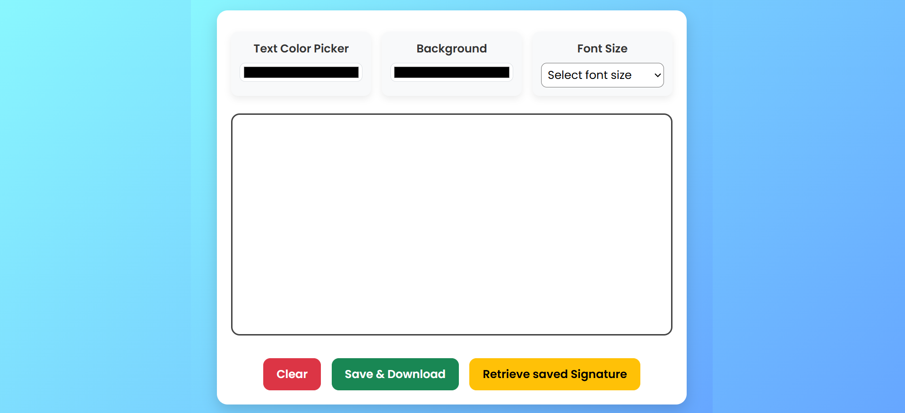
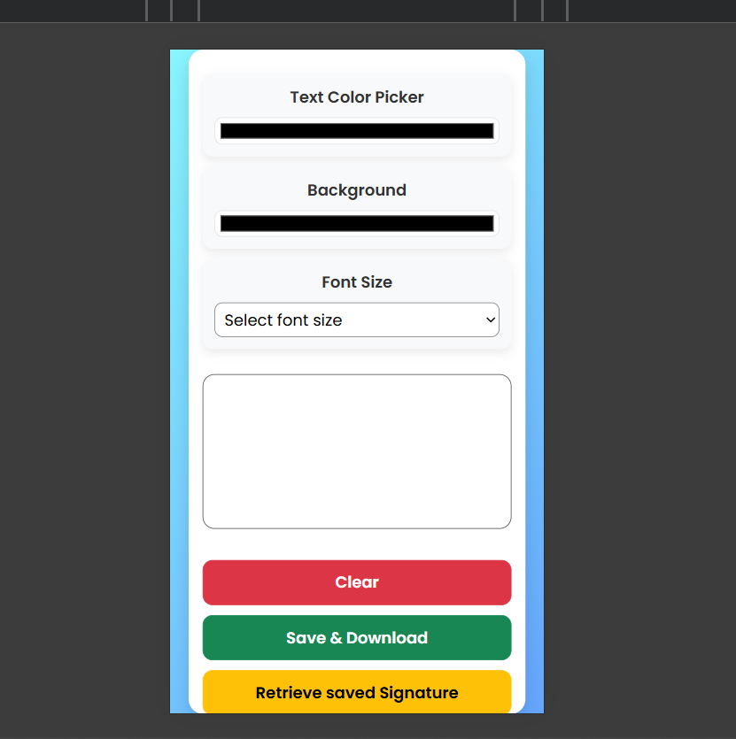

# ✍️ Canvas Drawing App

A clean and responsive web app to **draw, sketch, and save** your creations using the HTML5 Canvas API.  
Built with **HTML, CSS, JavaScript, and Bootstrap**.

---

## 🌟 Features
- 🎨 Pick stroke & background colors  
- ✏️ Adjustable brush size  
- 🧹 Clear the canvas instantly  
- 💾 Save drawings to LocalStorage  
- 📥 Download as PNG  
- 📱 Responsive design for all devices  

---

## 📸 Screenshots
  
  

---

## 🚀 Getting Started
1. Clone this repo:  
   git clone https://github.com/vighnesh204/canvas-drawing-app.git
